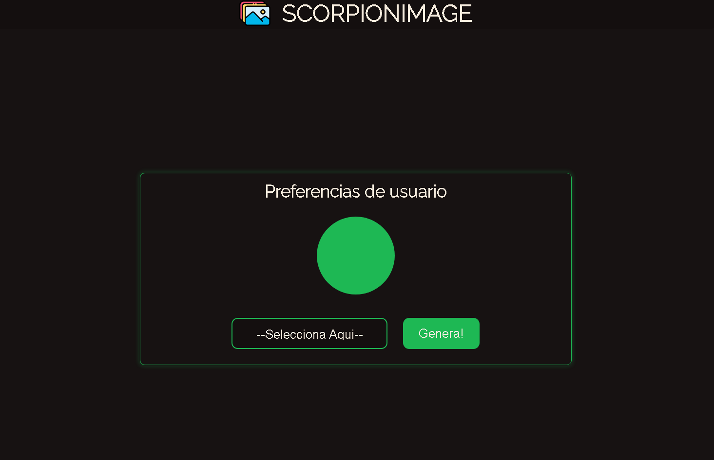
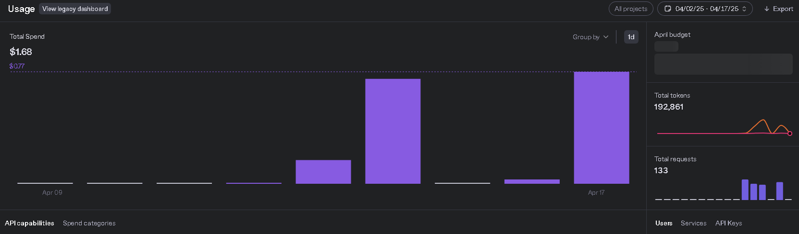
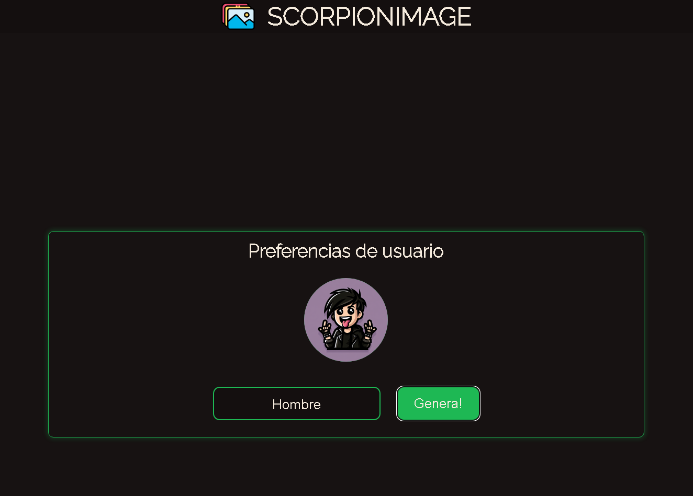
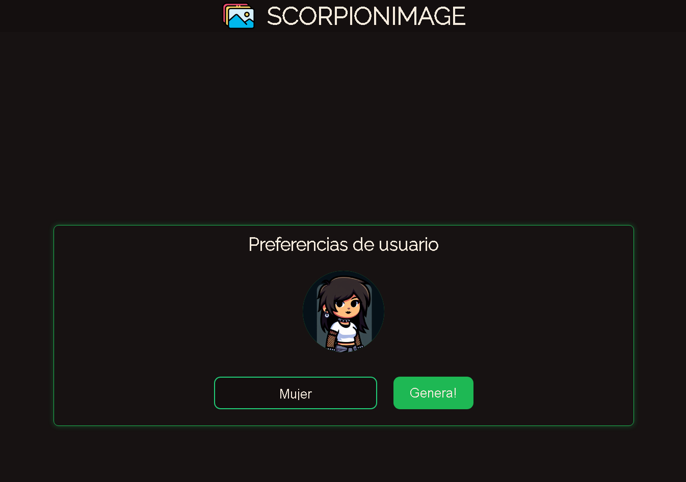

# SCORPIONIMAGES

SCORPIONIMAGES es una plataforma que genera avatares aleatoreos en base al modelo Dall-e-3. Este proyecto tiene la finalidad de mostrar un poco mi dominio en el uso de la API que brinda openAI para la generacion de imagenes.
**Este Proyecto no estara en un entrono de produccion debido al gasto que a mi me corresponde**

## Descripcion
Esta es una mini aplicacion que consta de enteramente una construccion en express, el backend sirve las peticiones y le da al usuario todo el frontend para visualizar la pagina. En esta ocacion no use React con el fin de poner en practica mi JS vanilla, mis conocimientos de html y css. La aplicacion es sencilla, solamente consta de un dropdown que te pide que es lo que quieres y un boton para enviar el formulario. 

## Tecnologias

### Backend
- **express** para levantar el servidor, y ser el encargado de enrutar y de peticiones
- **axios** para consumir la API de openAI, sin la necesidad de utilizar la libreria
- **dotenv** variables de entorno para que no me roben mi API key y no hagan mal uso de ella, ni sepan al puerto que levantamos el servidor

### Frontend
- **HTML** para las paginas
- **CSS** para los estilos
- **JavaScript vanilla** para toda la parte de funcionalidades
`recordemos que esto lo hago con el fin de hacer un repaso a las cosas basicas y no estancarme solamente con react`

## Costos
Por 30 imagenes generadas fue un total de $0.77 dolares

## Muestra del funcionamiento

